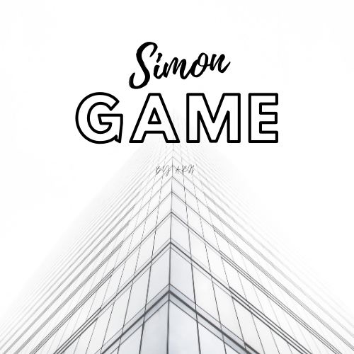

### Date: 5/15/2020
#### By: Alfonso D Rojas Hernandez 
#### [GitHub](https://github.com/acostade29) | [LinkedIn](https://www.linkedin.com/in/alfonso-d-rojas-hernandez-2253a0105/) | 
***

# Simon-says-firts-project-
#Drawings of the game.

|Rules of the game: |
|---|
| Inital game will start with 4 panels with different colors. with a start button.  |
| Each panel or buttons will produce will produce a particular tone withe it is pressed or actiated. 
| A round in the game consist on lighting up one or more buttons in a random order. |
| After the sequence of light is produce, the user will have to memorized the sequence and press the buttons in the correct order.  |
| the game will be over once the sequence is not follow. |
| there are 3 levels of dificulties: Easy, Medium, Hard numbers of buttons and time of memorization will be affected depending on the difficulty level| 

#Structure of the Game 
##HTML 

##css

## JS Structure game 

| Student will have to create in JS: |
|---|
| Step 1 :  put 4 color elements on the screen|
| step 2:  add event listeners to each |
| step 4:  play the first one or two colors in sequence (store in an array) |
| step 5:  get player entry (store in array)|
| step 6:  if solution array === player array, send congrats message and play element 3 of solution array|
| loop through steps 5/6 until winner or loser. | 

# diagram of the code 

<a href="https://app.diagrams.net/#G1BhJGg4Prv4K_bbhyqU1NnH0b8bpa4VB2">Diagram structure of the game code</a>

## Reference 
- for logic understending https://www.youtube.com/watch?v=W0MxUHlZo6U
- design reference https://www.youtube.com/watch?v=9MTR3V2XpRI
- webpage to be use as a main resource https://www.youtube.com/watch?v=n_ec3eowFLQ
- shapes css https://css-tricks.com/quick-css-trick-how-to-center-an-object-exactly-in-the-center/
- definitions https://p5js.org/
- how to use the promise function for flash the elements. https://editor.p5js.org/talkscheap/sketches/SJR8rSXlm / https://developer.mozilla.org/en-US/docs/Web/JavaScript/Reference/Global_Objects/Promise /https://www.youtube.com/watch?v=vn3tm0quoqE  / https://www.youtube.com/watch?v=PoRJizFvM7s

# simonsays
# simonsays
